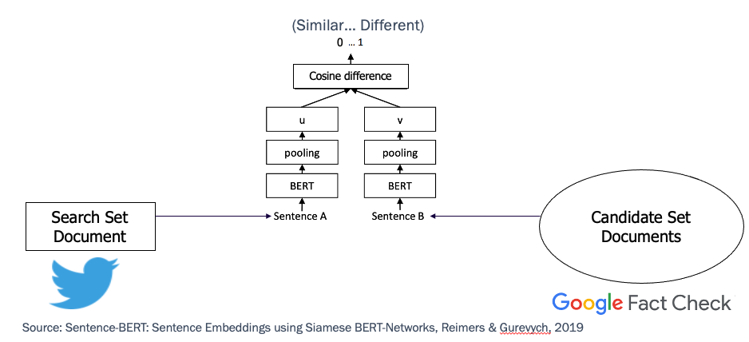

# Infodemic Claim-Matching

## Intro

This codebase matches COVID-19-related content from Google's Fact Check API to json files (e.g. Tweets) 

We have provided a claim matcher than can support matching claims from one set of data to another using semantic analysis.
More specifically, we use a SBERT to encode each claim from one set, which we call the search set. 
Then, we iterate over every encoding in another set, the candidate set, and pick the closest matches from each. 
For instructions on how to use the claim matcher, follow the instructions below, keeping in mind that the functionality 
is located in the `claimMatching` subdirectory.

## Claim Matching via Semantic Similarity
This repository leverages a pre-trained SBERT model (see Reimers & Gurevych 2019 for details) to rapidly compare two document sets at a sentence level. In the below example, we are searching a database of previously fact checked claims (the candidate set) with the tweets in our database. 

  

We pre-processed the search set (COVID-related Tweets, in this case), by filtering to English and to the top fact-checked claim terms via TF-IDF. We added this TF-IDF filtering step because converting tweets to embeddings is the longest step of the pipeline. This largely reduced the less relevant tweets we searched for matches to (e.g. Tweets of "This." or "That's the Tweet".) 

  

### Examples
Here's an example of a tweet and the closest matches in the fact-checked claim database: 

  

Here's an example of a claim and the closest tweets: 

  

## Claim-Matching Setup
1. Navigate to the root directory in Terminal.
2. Create a new virtual environment.
   2. On MacOS/Linux, run `python3 -m venv claimEnv` in Terminal.
   2. On Windows, run `py -m venv claimEnv` in CMD or Powershell.
3. Activate the virtual environment. This should be done every time you run code.
   3. On MacOS/Linux, run `source claimEnv/bin/activate`.
   3. On Windows, run `.\claimEnv\Scripts\activate`.
4. From the repository root, install every package needed by running `pip install -r requirements.txt`.
5. In the repository root, run the setup script.
   5. On MacOS/Linux, run `python claimMatching/setup.py`.
   5. On Windows, run `python .\claimMatching\setup.py`.
6. When finished running commands, run `deactivate` to stop using the virtual environment. Be sure to reactivate the
virtual environment per the instructions given above when you choose to run the jupyter notebooks or claim matcher.

### Dataset Terminology
In order to run the claim matcher, data must be fetched. There are two sets of data used
in the matcher: the search set (the data that is iterated over to find matches for) and
the candidate set (the potential matches for each item in the search set). For example, to find
the top 10 most similar matches from set "B" to each item in set "A", set "A" would be made
the search set and set "B" would be made the candidate set. Both sets support tweets from Twitter, claims from the
Google FactCheck API, and user supplied JSON from any source. The search set may contain manually
specified sentences. Below are instructions for how to set up each source for use.

### External Local Tweet Data Setup
1. Hydrate the Twitter data located at the [COVID-19 Twitter data respository](https://github.com/echen102/COVID-19-TweetIDs)
as jsonl files.
2. Move the desired hydrated jsonl files to `data_samples/tweets/`.

### Fact Check API Setup
In order to obtain the data for the Google Fact Check API, one must first set up a personal key via the following steps:
1. Follow the instructions located at https://support.google.com/googleapi/answer/6158862 to create an API key for your
